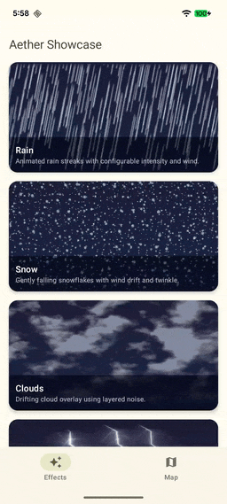
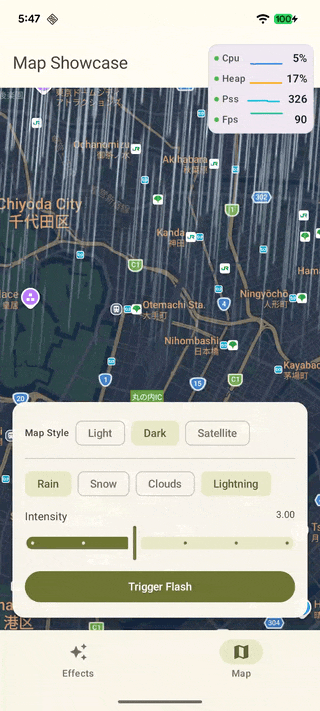

# Aether

GPU-accelerated weather effects for Android Compose, powered by [AGSL](https://developer.android.com/develop/ui/views/graphics/agsl).

<div align="center">
  <a href="https://central.sonatype.com/artifact/com.ms-square/aether"></a>
  <a href="https://github.com/Manabu-GT/Aether/actions/workflows/android-ci.yml"></a>
  <a href="https://developer.android.com/tools/releases/platforms#8.0"></a>
  <a href="https://kotlinlang.org"></a>
  <a href="https://developer.android.com/develop/ui/compose/bom/bom-mapping"></a>
  <a href="https://www.apache.org/licenses/LICENSE-2.0"></a>
</div>

<!-- TODO: Replace with actual GIFs -->
<p align="center">
  
  &nbsp;&nbsp;
  
</p>

## Highlights

- Runs entirely on the GPU via AGSL shaders (API 33+)
- Transparent overlay — renders on top of any content
- Battery Saver automatically downgrades quality to `LOW`; system "Remove animations" setting disables animated effects
- No-op on unsupported devices (< API 33) with a fallback option

## Installation

Add to your version catalog (`libs.versions.toml`):

```toml
[versions]
aether = "0.1.0"

[libraries]
aether = { module = "com.ms-square:aether", version.ref = "aether" }
```

Then add the dependency to your module's `build.gradle.kts`:

```kotlin
dependencies {
    implementation(libs.aether)
}
```

## Quick Start

```kotlin
// Apply rain as an overlay
Box(
    modifier = Modifier
        .fillMaxSize()
        .aetherOverlay(Rain())
) {
    // your content here
}
```

`aetherOverlay` also accepts a `qualityPreset` parameter (`LOW`, `MEDIUM`, `HIGH`) to control rendering quality. Defaults to `HIGH`.

## Effects

### Rain

```kotlin
val rain = remember {
    Rain(
        intensity = 3,       // 1–5 layers
        speed = 1.0f,        // fall speed multiplier
        dropLength = 1.0f,   // streak length multiplier
        wind = Wind.LightBreeze
    )
}
```

Presets: `Rain.light()`, `Rain.moderate()`, `Rain.heavy()`, `Rain.storm()`

### Snow

```kotlin
val snow = remember {
    Snow(
        density = 3,         // 1–5 layers
        speed = 1.0f,        // fall speed multiplier
        flakeSize = 1.0f,    // size multiplier
        wind = Wind.Calm
    )
}
```

Presets: `Snow.light()`, `Snow.moderate()`, `Snow.heavy()`, `Snow.blizzard()`

### Clouds

```kotlin
val clouds = remember {
    Clouds(
        coverage = 0.30f,    // 0 = wispy, 1 = overcast
        speed = 1.0f         // drift speed multiplier
    )
}
```

Presets: `Clouds.wispy()`, `Clouds.partlyCloudy()`, `Clouds.overcast()`

### Lightning Flash

```kotlin
val lightning = remember {
    LightningFlash(
        brightness = 1.5f,       // peak brightness multiplier
        boltCount = 3,           // 1–5 root bolts
        forkIntensity = 0.4f     // fork pattern intensity (0–1)
    )
}
val scope = rememberCoroutineScope()

// Trigger a flash
scope.launch { lightning.flash(durationMs = 300) }
```

### Combining Effects

Stack multiple effects by chaining modifiers:

```kotlin
val rain = remember { Rain() }
val lightning = remember { LightningFlash() }

Box(
    modifier = Modifier
        .fillMaxSize()
        .aetherOverlay(rain)
        .aetherOverlay(lightning)
)
```

## Compatibility

| | Requirement |
|---|---|
| **Minimum SDK** | 26 (Android 8.0) |
| **Effects active** | 33+ (Android 13 — AGSL required) |

On devices below API 33, `aetherOverlay` is a no-op. Use the `fallback` parameter to provide an alternative:

```kotlin
Modifier.aetherOverlay(
    effect = Clouds(),
    fallback = Modifier.background(Color.Gray)
)
```

You can also check at runtime:

```kotlin
if (isAetherAvailable()) {
    // AGSL effects supported
}
```

## Sample App

The [sample app](sample) showcases all effects with interactive controls and a Google Maps overlay demo.

To run it:

1. [Sign up with Google Maps Platform][Sign up with Google Maps Platform] and create a [project] with the **Maps SDK for Android** enabled
2. Obtain an [API key] (follow the [API key instructions] if you're new to the process)
3. Create a `secrets.properties` file in the project root:
   ```properties
   MAPS_API_KEY=YOUR_GOOGLE_MAPS_API_KEY
   ```
4. Build and install:
   ```bash
   ./gradlew :sample:installDebug
   ```

> **Note:** The effects gallery and playground work without a Maps API key. The key is only required for the Map tab.

[Sign up with Google Maps Platform]: https://developers.google.com/maps/gmp-get-started
[project]: https://developers.google.com/maps/documentation/android-sdk/cloud-setup
[API key]: https://developers.google.com/maps/documentation/android-sdk/get-api-key
[API key instructions]: https://developers.google.com/maps/documentation/android-sdk/config#step_3_add_your_api_key_to_the_project

## Changelog

See [CHANGELOG.md](CHANGELOG.md) for release history.

## License

[Apache License 2.0](LICENSE)
